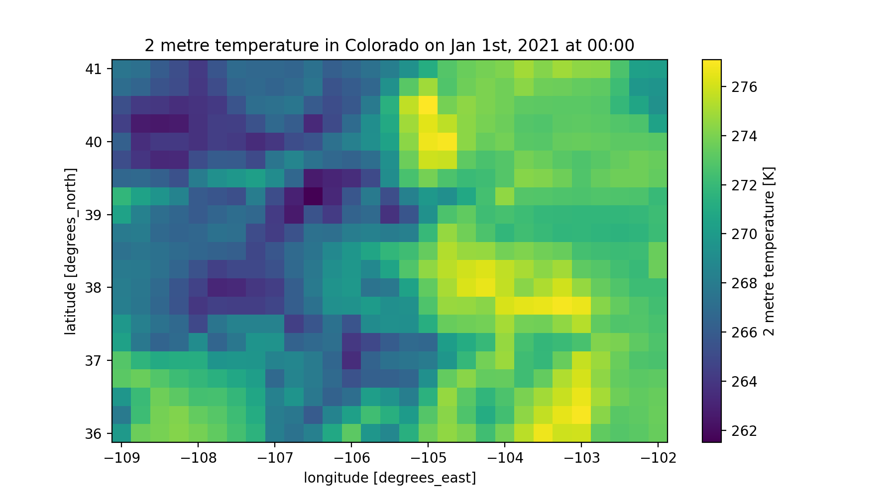

# bmi_era5
[](https://bmi_era5.readthedocs.io/en/latest/?badge=latest)
[](https://github.com/gantian127/bmi_era5/blob/master/LICENSE.txt)
[](https://mybinder.org/v2/gh/gantian127/bmi_era5/master?filepath=notebooks%2Fbmi_era5.ipynb)


bmi_era5 package is an implementation of the Basic Model Interface ([BMI](https://bmi-spec.readthedocs.io/en/latest/)) 
for the [ERA5](https://confluence.ecmwf.int/display/CKB/ERA5) dataset. 
This package uses the [CDS API](https://cds.climate.copernicus.eu/api-how-to) to download the ERA5 dataset and wraps the dataset with BMI for data control and query 
(currently support 3 dimensional ERA5 dataset). 
This package is not implemented for people to use but is the key element to convert the ERA5 dataset into 
a data component for the [PyMT](https://pymt.readthedocs.io/en/latest/?badge=latest) modeling framework developed by Community Surface Dynamics Modeling System 
([CSDMS](https://csdms.colorado.edu/wiki/Main_Page)).
 
If you have any suggestion to improve the current function, please create a github issue 
[here](https://github.com/gantian127/bmi_era5/issues).

## Get Started

#### Install package

Please make sure to first install the
[CDS API](https://cds.climate.copernicus.eu/api-how-to)
and then follow the instructions below to install the bmi_era5 package.

##### Stable Release

The bmi_era5 package and its dependencies can be installed with pip
```
$ pip install bmi_era5
```


<!--or conda
```
$ conda install -c conda-forge bmi_era5 
```-->

##### From Source

After downloading the source code, run the following command from top-level folder 
(the one that contains setup.py) to install bmi_era5.
```
$ pip install -e .
```

#### Download ERA5 Data

Learn more details of the examples from the [tutorial notebook](https://github.com/gantian127/bmi_era5/blob/master/notebooks/bmi_era5.ipynb) 
provided in this package. You can also launch binder to test and run the code below.

##### Example 1: use CDS API to download the ERA5 data 

```python
import cdsapi
import xarray
import matplotlib.pyplot as plt

c = cdsapi.Client()

c.retrieve(
    'reanalysis-era5-single-levels',
    {
        'product_type': 'reanalysis',
        'format': 'netcdf',
        'variable': ['2m_temperature', 'total_precipitation'],
        'year': '2021',
        'month': '01',
        'day': '01',
        'time': [ '00:00', '01:00', '02:00'],
        'area': [ 41, -109, 36, -102],
        'grid': [0.25, 0.25]
    },
    'download.nc')

# load netCDF data
dataset = xarray.open_dataset('download.nc')

# select 2 meter temperature on 2021-01-01 at 00:00 
air_temp = dataset.t2m.isel(time=0)

# plot data
air_temp.plot(figsize=(9,5))
plt.title('2 metre temperature in Colorado on Jan 1st, 2021 at 00:00')
```



##### Example 2: use BmiEra5 class to download the ERA5 data (Demonstration of how to use BMI)

```python
from bmi_era5 import BmiEra5
import numpy as np
import matplotlib.pyplot as plt

data_comp = BmiEra5()
data_comp.initialize('config_file.yaml')

# get variable info
for var_name in  data_comp.get_output_var_names():
    var_unit = data_comp.get_var_units(var_name)
    var_location = data_comp.get_var_location(var_name)
    var_type = data_comp.get_var_type(var_name)
    var_grid = data_comp.get_var_grid(var_name)
    var_itemsize = data_comp.get_var_itemsize(var_name)
    var_nbytes = data_comp.get_var_nbytes(var_name)
    print('variable_name: {} \nvar_unit: {} \nvar_location: {} \nvar_type: {} \nvar_grid: {} \nvar_itemsize: {}' 
            '\nvar_nbytes: {} \n'. format(var_name, var_unit, var_location, var_type, var_grid, var_itemsize, var_nbytes))

# get time info
start_time = data_comp.get_start_time()
end_time = data_comp.get_end_time()
time_step = data_comp.get_time_step()
time_unit = data_comp.get_time_units()
time_steps = int((end_time - start_time)/time_step) + 1
print('start_time:{} \nend_time:{} \ntime_step:{} \ntime_unit:{} \ntime_steps:{}'.format(
    start_time, end_time, time_step, time_unit, time_steps))

# get variable grid info 
grid_rank = data_comp.get_grid_rank(var_grid) 
grid_size = data_comp.get_grid_size(var_grid)

grid_shape = np.empty(grid_rank, int)
data_comp.get_grid_shape(var_grid, grid_shape)

grid_spacing = np.empty(grid_rank)
data_comp.get_grid_spacing(var_grid, grid_spacing)

grid_origin = np.empty(grid_rank)
data_comp.get_grid_origin(var_grid, grid_origin)

print('grid_rank: {} \ngrid_size: {} \ngrid_shape: {} \ngrid_spacing: {} \ngrid_origin: {}'.format(
    grid_rank, grid_size, grid_shape, grid_spacing, grid_origin))

# get variable data 
data = np.empty(grid_size, var_type)
data_comp.get_value('2 metre temperature', data)
data_2D = data.reshape(grid_shape)

# get X, Y extent for plot
min_y, min_x = grid_origin
max_y = min_y + grid_spacing[0]*grid_shape[0]
max_x = min_x + grid_spacing[1]*grid_shape[1]
dy = grid_spacing[0]/2
dx = grid_spacing[1]/2
extent = [min_x - dx, max_x + dx, min_y - dy, max_y + dy]

# plot data
fig, ax = plt.subplots(1,1, figsize=(9,5))
im = ax.imshow(data_2D, extent=extent)
cbar = fig.colorbar(im)
cbar.set_label('2 metre temperature [K]')
plt.xlabel('longitude [degree_east]')
plt.ylabel('latitude [degree_north]')
plt.title('2 metre temperature in Colorado on Jan 1st, 2021 at 00:00')
```


